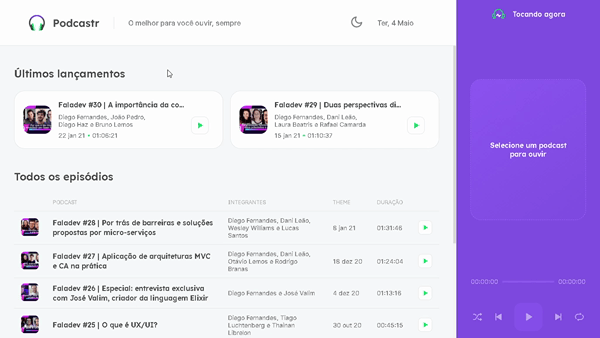

<h1 align="center">
  
</h1>

<strong>🎧 Listen to podcasts in a simple way on the Podcastr platform</strong> Developed at NLW#5 Practical project for study

  
  
  
  
  
  

<h2>
  Table of contents
</h2>
<ul>
  <li><a href="./README.md#Status">Status</a></li>
  <li><a href="./README.md#Demonstration">Demonstration</a></li>
  <li><a href="./README.md#Extra_Features">Extra Features</a></li>
  <li><a href="./README.md#Running-Locally">Running Locally</a></li>
  <li><a href="./README.md#Technologies">Technologies</a></li>
  <li><a href="./README.md#Author">Author</a></li>
  <li><a href="./README.md#License">License</a></li>
</ul>

<h2>Status</h2>
<h4 align="center">🚧 Podcastr is in development 🚀</h4>

<h2>Demonstration</h2>

  <strong>To access and test the Podcastr platform, click on the link: https://podcastr-silvio-ronaldo.vercel.app</strong>

<h3>Home</h3>
  

    
  

<h3>Player</h3>
  

    
  

<h3>Episode</h3>
  

    
  

   

<h2>Extra Features</h2>
<h3>Dark Mode</h3>
  

    
  

  
  
<strong>🆕 New extra features are in development... ⚒️</strong>

  
  
<h2>Running locally</h2>
<h3>Prerequisites</h3>
<ol>
  <li><strong>Installing Git:</strong> You need to have Git on your machine to perform a few steps. To download Git, click <a href="https://git-scm.com/downloads">here.</a></li> 
  <li><strong>Installing Yarn 1:</strong> Yarn is a package manager that you can download directly from the website by clicking <a href="https://classic.yarnpkg.com/en/docs/install#windows-stable">here.</a> If you prefer, use the NPM.</li> 
  <li><strong>Code Editor (optional):</strong> Make sure you have a code editor of your choice. I recommend using the VS Code. If you need to, download it <a href="https://code.visualstudio.com/Download">here.</a></li>
</ol>

<h3>Running the Nextjs App</h3>
<ol>
  <li>In a terminal, clone this repository:
    
<code>git clone https://github.com/Silvio-Ronaldo/podcastr.git</code>

  </li>
  <li>Enter the project folder:
    
<code>cd podcastr</code>

  </li>
  <li>Install all dependencies:
    
<code>yarn install</code> or <code>yarn</code>

  </li>
  <li>Start the development server:
    
<code>yarn dev</code>

  </li>
  <li>After these steps, the server should start at the <strong>3000</strong> port, open the browser and access <a href="http://localhost:3000">http://localhost:3000</a>.</li>
</ol>

<h2>Technologies</h2>

The following tools were used in the development of the project: 

<ul>
  <li><a href="https://nextjs.org">Next.js</a></li>
  <li><a href="https://pt-br.reactjs.org">React</a></li>
  <li><a href="https://www.typescriptlang.org">TypeScript</a></li>
  <li><a href="https://styled-components.com">Styled Components</a></li>
  <li><a href="https://date-fns.org">date-fns</a></li>
  <li><a href="https://www.npmjs.com/package/rc-slider">rc-slider</a></li>
  <li><a href="https://react-icons.github.io/react-icons/">React Icons</a></li>
</ul>

<h2>Author</h2>

  

<strong>Silvio Ronaldo 🍀</strong>

Leave your star, fork the project or open a pull request ❤️

Contact me on social networks: 

<h2>License</h2>

<strong>Podcastr is MIT licensed, as found in the LICENSE file.</strong>

  
  

  
  
 

